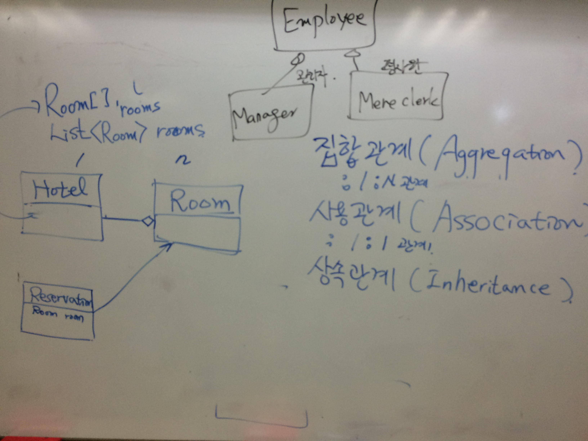
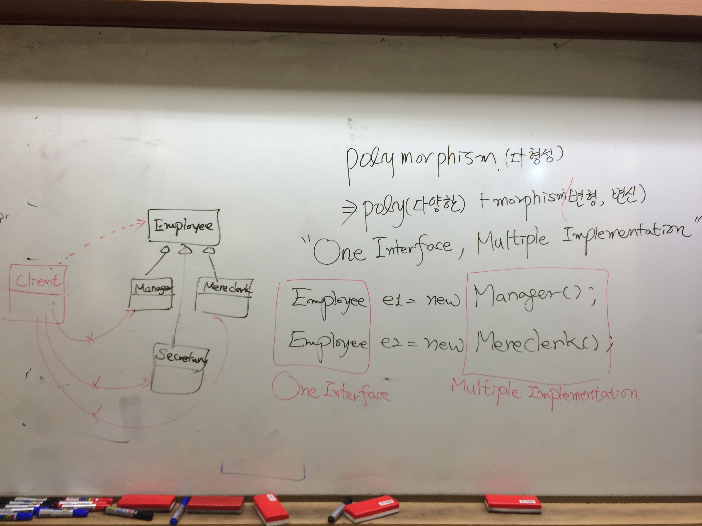
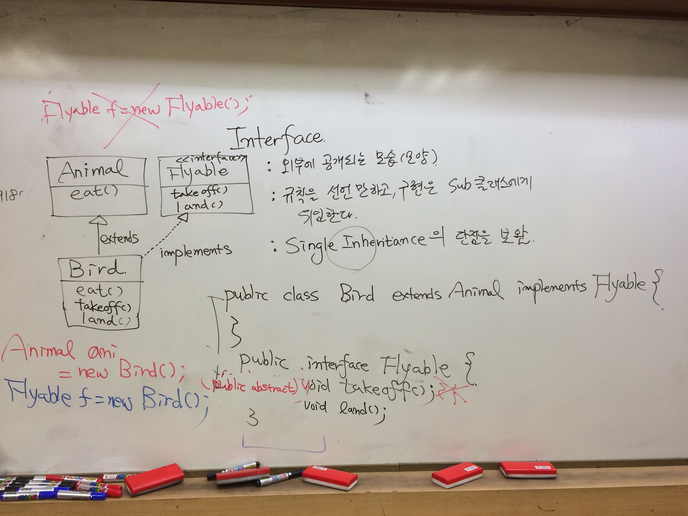

**[날짜 선택화면](../README.md)**

##enum

열거
public enum 클래스이름{}
public enum week{MONDAY,TUESDAY,WEDNESDAY,THURSDAY,FRIDAY}

run configurations -> Arguments 탭 -> Program arguments MONDAY 입력

##OOP
속성과 동작, 필드와 메서드

- 집합관계(Aggregation) : 자동차 구성요소 - 엔진, 타이어, 핸들
1:N 관계 자동차1 N개의 객체 정보

- 사용관계(Association) : 사람이라는 객체
1:1 관계

- 상속관계(Inheritance)

## UML(unified Modeling Language)

Hotel클래스 Room 클래스
호텔안에 룸이 여러개 있으면 1:N

- 네모박스 클래스, 선은 association 관계

- N은 다이아몬드 표시함.

- Room 배열 Rood[] rooms, List<Room> rooms (컬렉션 타입 저장)

사용관계
Reservation 클래스가 룸정보를 참조한다고 하면 association 

상속관계 

employee <- Manager
<- Mere clerk

- 상속, 다형성, 캡슐화

메서드나 변수 외부에서 접근못하게 막음.

##클래스 구성멤버

1. 필드
2. 생성자
3. 메소드

- 생성자의 역할은 인스턴스 변수 초기화, 객체를 생성될때 불려짐.

- 생성자 오버로딩 : 파라미터 아규먼트 갯수 다르게 받는것 

- 메서드 오버로딩 : 매개변수 타입 개수 순서가 다른것.

------------------------------------------------------

##멤버변수

1. Instance Variable(=non static) : 객체 생성시 고유한 값을 갖는 변수 , 바로 접근 못하고 반드시 객체 생성하고 접근해야함.

언제 초기화 할것인가?

2. Static Variable(=class) : 클래스에 속한 변수

왜 static붙이고 안붙이나?

카드를 만든다고 생각하자.

- card 종류별로 객체만들면 다름.

- suit: int
- width, height는 카드객체 생성될때 width, height 값이 같음.
- 그러므로 굳이 Instance Variable로 갈 필요가 없다.
- 굳이 힙영역에 각각 메모리 공간 만들어서 suit라는 방에 메모리 낭비할 필요없다.

  - suit: int
  - static height: int
  - static width: int

this
static{ // stati initializer

}

##싱글톤

- 싱글톤 형태로 쓰는이유 : 매번 메모리 힙에 객체가 썻다 지웠다 문제발생
- 객체를 단 하나만 생성되게함.
- 디자인패턴 - 구현하기전 클래스 설계할 때 개발자들에게 가이드를 줌.
- 패턴을 학습해야하는 단점이 있지만, 가이드라인을 주면 적용함
- 객체를 생성후 계속 재사용하고 싶을때 싱글톤을 사용함.

생성 패턴(creational pattern) 
구조 패턴(structural pattern)
행위 패턴(behavior pattern)

## 단축키

- 주석 ctrl+shift+/, ctrl+/
- 주석 풀기 ctrl+shift+\
- ctrl+shift+f

## final 상수

선언과 동시에 초기화 할수있고, 선언만 해놓고 초기화는 생성자에서 할수 있음.
생성자에서 값을 초기화 시켜놨음.
컴파일 오류 발생

## 패키지, import

패키지란 파일관리 위해 사용하는 폴더 

import 디렉토리 별로 분류

public(+) > protected(#)(Same package + Subclassing) > default(~)(Same package)> private(-)(Same Class)
	   		

+,#,~,- 기호이다.

패키지가 달라도 상속관계이면 접근되는것이 protected

**각 접근제한자를 붙일수 있는것.**

1. public - class, constructor, method, field

2. protected - field,method,constructor

3. default - class, field, method, constructor ex) class car

4. private - field, method, constructor

## 상속

**상속을 쉽게 하는 방법**

.java 파일 클릭후 -> refactor -> extract superclass -> superclass name

-> add -> MereClerk - company -> name,salary,getname(),getsalary()

employee 클래스의 부모는 object클래스다.
super(); 오브젝트 생성자 콜하는 것.
얘 부모 상위 클래스 즉 오브젝트 생성자 호출하는 문장임.

생성자 오버로딩

## 클래스 상속

단일상속 해결위해 인터페이스 사용

부모 생성자 호출 할때 super(매개변수) 매개값, 통일한 타입, 개수, 순서 맞춰야함.

## 오버라이드

abstract 추상메서드 만드는 이유는 바디(블록) 없고 선언만 되어있는 메서드 

추상메서드 만들면 추상클래스 선언해줘야함.

## 다형성

polymorphism(다형성)
-> poly(다양한) + morphism(변형, 변신)

"one interface , multiple implementation"

원 타입 = 구현은 다양하게
Employee e1 = new Manager();
Employee e2 = new Mereclerk();

one interface , multiple implementation

Employee

6,7,8

publication 만들고
magazine 

레퍼런스북
super class를 company.publication 로 하고 construction from superclass 체크 들어간다.

publication에 출판과 관련된 제목 페이지수 

magazine월간지냐 주간지냐

규약을 만들었음.

ms-sql
was 

novel 저자 누구냐
레퍼런스북은 어떤분야 레퍼런스북

##인터페이스

jdbc 인터페이스  오라클(db벤더 (객체)), mysql 가 

개발코드 변경없이 실행환경 다르게 할수있다.
개발자는 인터페이스만 보고 코딩함.

Interface : 외부에 공개되는 모습(모양)
인터페이스가 안좋아 -> 보여지는 모습
: 규칙을 선언만하고 구현은 sub클래스에게 위임한다.
: SingleInheritance의 단점을 보완

Animal
eat()
↑extends
Bird
eat() → implements <<interface>> flyable

여러가지 기능을 계속 implements는 여러번 가능

인터페이스에 있는 기능 쓰려면 반드시 오버라이딩 해야함

public class birds extends Animal implements Flyable{
 
}
public interface flyable{
 (public abstract)void takeoff();
  		  void land();
}

Animal ani = new Bird(); (o)
Flyable f = new Flyable(); (x) 추상보다 더 추상이므로 
Flyable f = new Bird(); (o)

실습 : new -> interface

추상은 이탤릭체

bird클래스 생성시 superclass chap08.animal, interface chap08.flyable 추가

**다른점**
1. 추상클래스는 바디가 있는 메서드 콘크리트 추가로 추상메서드 가질수 있다.

2. 인터페이스는 추상메서드만 가질수 있다.

**공통점**
1. 추상클래스와 인터페이스 공통점은 자기 자신이 스스로 객체 생성 불가

2. 반드시 하위클래스 통해서 객체 생성해야 한다.

- 추상클래스로부터 바로 생성자 받아오지 못함.
- 인터페이스 생성자를 상위클래스에서 추가해야함.
