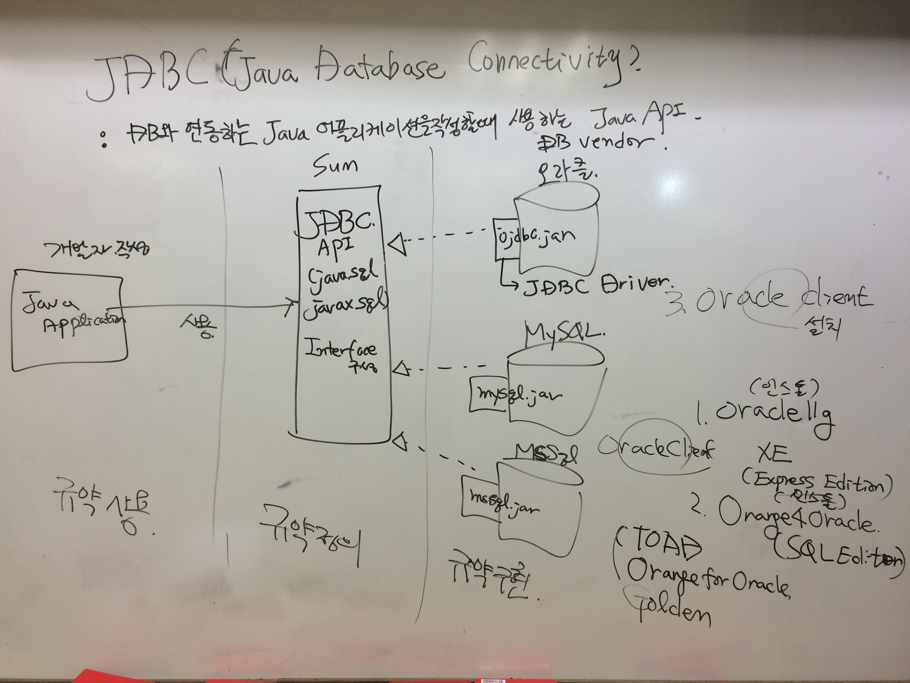
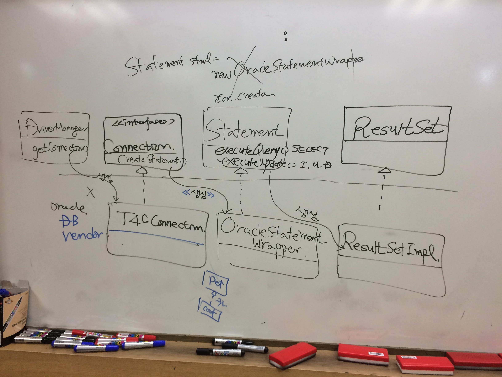

**[날짜 선택화면](../README.md)**

저장영역이 다름

final

힙에 저장

static final

+public #protected ~default -private

## JDBC

- DB에 종속적으로 코딩하면 안됨.

- DB에 질질 끌려다녀선 안됨

- 벤더가 바뀌더라도 JDBC 이용해서 작성하는것 똑같음.

- WAS가 바껴도 코딩방식은 똑같음. servlet/jsp 쓸수있고 tomcat 쓸수있고 개발자는 인터페이스만 보고 가져다 씀.

- 중립적으로 코딩위해 개발자는 인터페이스만 메서드 보고 코딩하고 구현은 DBMS 벤더에게 맡김.

- 개발자가 중립적으로 코딩하는것이 중요해짐.

**DBMS 벤더**

JDBC(Java DataBase Connectivity) : DB와 연동하는 Java어플리케이션 작성할때 사용하는 javaAPI

1. (개발자 작성)규약사용
 - Java Application이 JDBC API 사용

2. (sun이 만듬) 규약정의
 - JDBC API(java.sql, javax.sql, interface) 

3. (DB벤더) 규약구현
 - 오라클 ojb.jar -> JDBC Driver 제공해줘야함.
 - MySQL mysql.jar
 - MsSQL mssql.jar

****

- sql을 진짜 많이 씀. 쿼리작성

- SQL문 에디팅할수있는 툴을 많이 씀. 대표적인 툴로 TOAD, orange4Oracle(SQL Editor) 이 있다.

- 오라클클라이언트 자동으로 깔리지 않음.

  1. Oracle11g XE(Express Edition)
  2. Orange4Oracle(SQL Editor)
  3. 오라클 클라이언트(instant Client) 설치

- jar를 클래스패스 설정하고 jdbc api 사용해서 java application 작성해보는것이 실습

DB는 예외처리 필수적으로 함.

**다운로드 링크**

[DB Express Edition 11g](https://drive.google.com/open?id=0B-z2J00dR5L7QTBySGJld05kUTA) 

공식: http://www.oracle.com/technetwork/database/database-technologies/express-edition/downloads/index.html

[JDBC Driver](https://drive.google.com/open?id=0B-z2J00dR5L7RGkwTWRxakFuTGs) 

공식: http://www.oracle.com/technetwork/database/enterprise-edition/jdbc-112010-090769.html

- JDBC Driver는 .jar 형태 파일로 이클립스에서 추가가능하다.

- build path -> configure build path -> add external jars -> ojdbc6.jar 추가 

[instant Client](https://drive.google.com/open?id=0B-z2J00dR5L7bUFRY1FQcWVYUEE)

공식: http://www.oracle.com/technetwork/database/features/instant-client/index-097480.html

[Orange for Oracle](https://drive.google.com/open?id=0B-z2J00dR5L7Y1JZRWMtTThydDQ)

1. DBMS 벤더별로 제공하는 Driver 클래스 등록해야함.

2. DBMS와 연결해야하는데 Connection 이라는 객체 생성됨.

3. 연결했으면 SQL문을 작성해서 DBMS한테 전달해야함.

4. statement 작성해서해야하고 전송 및 실행

5. SQL 실행한 결과를 받아서 콘솔에 뿌려주거나 UI에 뿌려줌.

6. closed를 통해 Connection Statement 객체들을 반납해줘야함

커넥션 객체 생성 위해 드라이버 매니저 클래스에 getConnection 메서드 콜해야함.

**orange for oracle 툴을 사용하기 위한 사전 작업**

1. C:\oraclexe\app\oracle\product\11.2.0\server\network\ADMIN tnsnames.ora 파일을 복사함. (오라클 설치 폴더 안에 파일있음.)

2. C:\java\instantclient-basic-nt-11.2.0.3.0\instantclient_11_2 에 tnsnames.ora 파일 붙여넣기.

**orange 초기작업**

orange options -> environment -> user Instant -> instant client path 

- hr 계정 unlock

alter user hr identified by hr account unlock; + ctrl enter

employees -> view data

not null 은 필수적으로 들어가야할 `컬럼이다.

학번으로 개개인 구별

사원정보 가지고있으면 사원번호 중복되면 안된다.
varchar2는 가변길이, 문자열을 저장하는 데이터타입

전체자리수는 8이고 소수점 2번째자리까지 허용

insert
select - executeQuery()
update - executeUpdate()
delete - return 1 은 no count

- executeQuery(), executeUpdate() 실행하니깐 ResultSetImpl 생성해주고 ...

- 컬럼의 값을 받아오는것을 get...()

정상: try -> finally
오류: try -> catch -> finaaly

정상이건 오류건 finally는 반드시 실행한다.

##단축키

- 소스블록 지정하고 alt 하고 방향키로 움직인다.

departments 뿌리기

create user scott identified by tiger default tablespace USERS temporary tablespace temp;

유저 scott을 만드는데 비밀번호는 tiger이고 기본 테이블공간은 USERS이고 임시테이블공간은 temp로 만든다.

grant connect, resource to scott;

scott에게 자원과 커넥트를 준다.

사용자에게 제약조건 pk

jdbc 쓰는 이유는 어플리케이션 만들어서 db 붙여서 쓰는것.
db 조작 조회하기 위해 sql 쓴다.