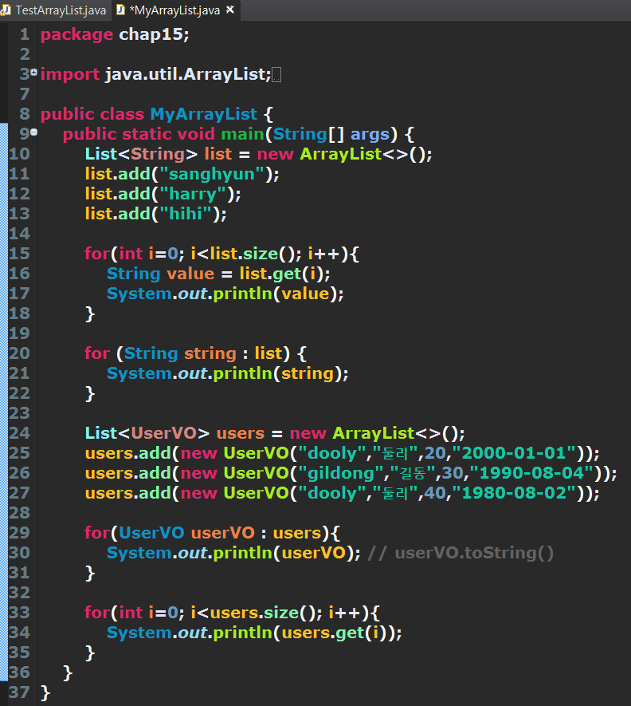
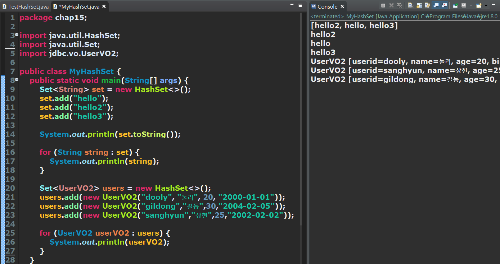
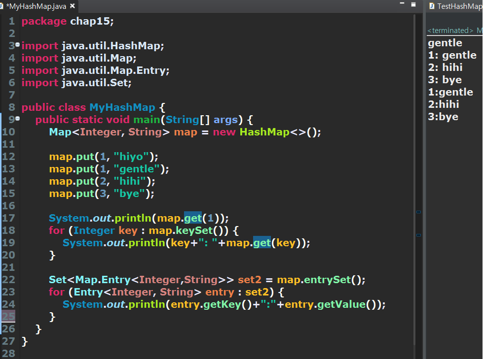

**[날짜 선택화면](../README.md)**

##저번주 배운것 정리

- DB에 독립적인 어플리케이션 작성하기 위해서 JDBC 사용

- jar(ojdbc6.jar <- JDK 1.6이상)를 다운받는다.

1. Driver등록(6버전이후로 내부적으로 드라이버 등록을 처리해줘서 드라이버 등록 안해줘도 됨. 하지만 6이전버전 JDBC사용의 경우 반드시 드라이버 등록해줘야 한다.)

  - Class.forName("oracle.jdbc.driver.OracleDriver“ );쓰면 내부적으로 Driver 클래스(DriverManager.registerDriver(new OracleDriver))가 등록됨.

2. DBMS와 연결(연결을 담당하는건 connection 객체 이다.)
  - getConnection 프로토콜,서브프로토콜
  - tnsnames.ora에 정보 들어있음.
  - String url = "jdbc:oracle:thin:@127.0.0.1:1521:xe";

3. statement생성
  - Statement stmt = conn.createStatement();

4. sql 전송

5. 결과 받기(resultset 처리)

6. 닫기(close)

- StringBuffer 무겁고 보장가능
- StringBuilder 가볍고 멀티스레드 사용시 보장불가

## 예외의 종류

1. CheckedException 일반(컴파일러 체크) 예외들
  - java.lang.ClassNotFoundException, java.lang.InterruptedException

2. RuntimeException
  - try catch 안하지만 필요에따라 exception 처리해주는것이 좋다.
  - NullPointerException, NumberFormatException

- 멀티캐치할때 상위클래스가 밑에 있어야 한다.
catch(){}catch(){} 

- 멀티 캐치 할때 여러개의 예외처리 가능 catch(exception | exception)

## throws

- 던진 exception을 호출한곳에서 catch하여 예외처리할수 있다.

## 사용자 정의 예외
throw new XXXException("메시지");
thorw는 exception을 생성할때 씀.

getMessage

## PreparedStatement

\<\<interface\>\>|
------------------|
Statement|
  ↑|
Preparedstatement|

SQL 전송해주고 실행해주는 역할이 statement

ex)

intsert into customer(0,0,0)
values(0,0,0,0,0)
테이블명(컬럼명)

"'"+SSN+"'" 

- intsert into customer만 같고 밸류값만 다르다.
- 이런 공통적인 SQL문은 미리 준비하고 미리 precomplie하라고함.

- 가변적으로 인서트구문 만번 돌릴때 밸류만 보내줄게
- values(?,?,?,?,?) 물음표를 써줌.
- 물음표에 들어갈 값만 밑에서 set해주는것이다.
- 동적으로 들어갈 값 ?(물음표)로 처리

- preparedstatement는 일반 statement보다 속도가 빠르다.

- statement.setString(1,0)
- statement.setString(2,0)

VO(value object) or DTO(Data Transfer object)
-멤버변수, getter/setter로 이루어진 객체를 VO 객체라 한다, 생성자

값을 한꺼번에 객체에 담아서 통신하기

Mybatis, Hibernate, JPA(Java Persistence API)를 ORM(Object Relational Mapping) Framework라 한다.

##UserVO

- Users Table

userid|name|age|birth
------|----|----|---------
dooly | 둘리 | 20 | 2000-01-01

userid 일일히 맵핑작업 멤버변수에 저장함.
name
age
birth

Mybatis는 개발자가 UserVO 객체만 만들고 UserVO가 자동맵핑해준다.

1. ROW UserVO
2. ROW UserVO

UserVO객체가 여러건 생성
한 건이 UserVO객체에 저장된다.
여러개 객체 저장할려면 배열 쓰거나 컬렉션(List,Set,Map) 써야한다.
List에 여러개의 객체 저장할거다.

generate toString

## X-internet 

- 화면 UI를 쉽게 만들수 있는 프레임워크 ex) 마이플랫폼, 가우스, 트러스트폼

## 컬렉션 프레임워크 List, Set, Map

- 같은 타입 여러개 저장하는것이 배열

- 배열 선언할 떄 배열 방 사이즈 미리 정해줘야함.

- 레코드수가 몇인지 모름.

- count*

1. **list** 계열은 순서를 유지하고 저장, 중복저장가능
2. **set** 계열은 순서 유지않고 저장, 중복저장 안됨 HashSet, TreeSet
3. **map** 계열은 키와 값의 쌍으로 저장, 키는 중복 저장 안됨

hotel <---1--:---N--> room 

set을 가져야함.

##List

##Set

##Map

## generic

제너릭이 나온 배경을 설명해보면

\<\<interface\>\>|
-----------------|
Collection|
↑|
\<\<interface\>\>|
List|
↑|
arrayList|

ArrayList 객체 생성

Collection list1 = new ArrayList();

List list2 = new ArrayList();

ArrayList list3 = new ArrayList();

## object였다가 E(element)가 나온이유가 뭘까?

<E> generic

ex)

JDK 1.4이하의 경우

List list = new ArrayList();
list.add(new String("hello"));
list.add(new Integer(10));

for(int i = 0; i<=list.size(); i++){ list.get(i); }

string value = (string)list.get(i);

object타입이니 string으로 형변환해줘야함. 하지만 integer는 string으로 형변환 안되서 오류발생하고 알아내지 못함.

최상위 클래스인 object 클래스로부터 그전엔 모두 받았지만 어떤 데이터와 데이터타입이 들어올지 모르고 오류가 발생시 개발자가 오류를 해결하기 힘들어짐 -> \<E\> 엘리먼트 타입을 주어 해당 타입에 데이터만 받자고 바뀜.

- JDK5.0이상 부터는 List<String> list = new ArrayList<String>(); 썻다.

- 1.7이상부터 List<String> list = new ArrayList<>(); 썻다.

list.add(new string("hello");
list.add(new Integer(10)); x 컴파일 오류

for(i=0;i<=list.size;i++){ string value = list.get(i);}

